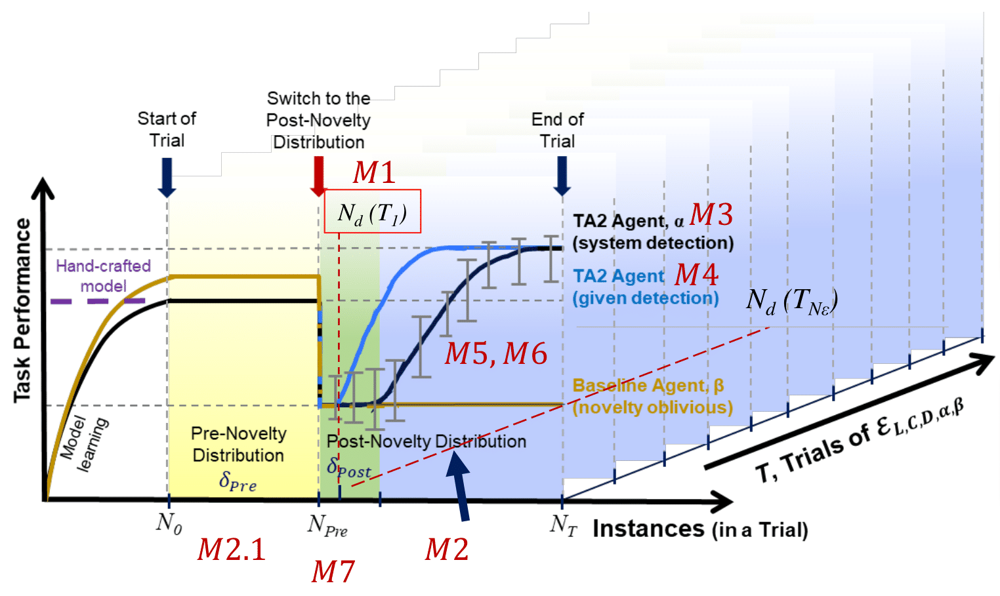
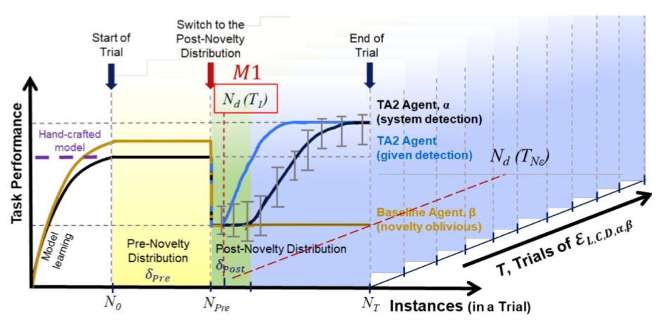
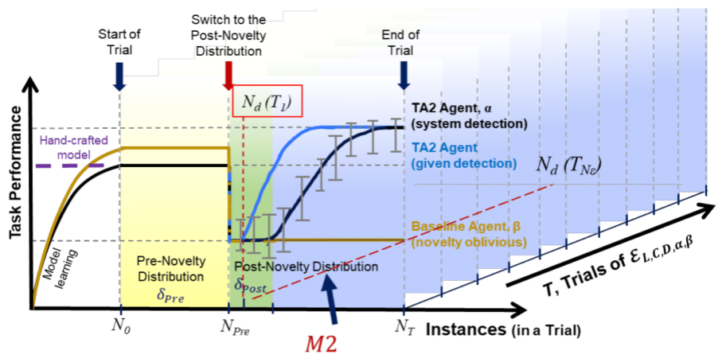
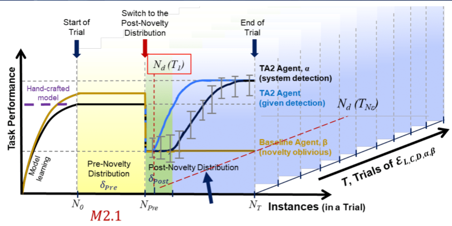
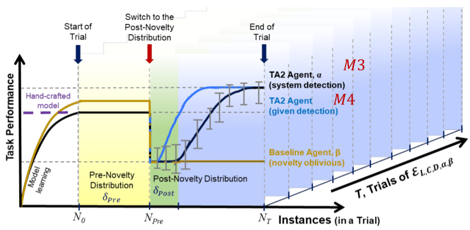
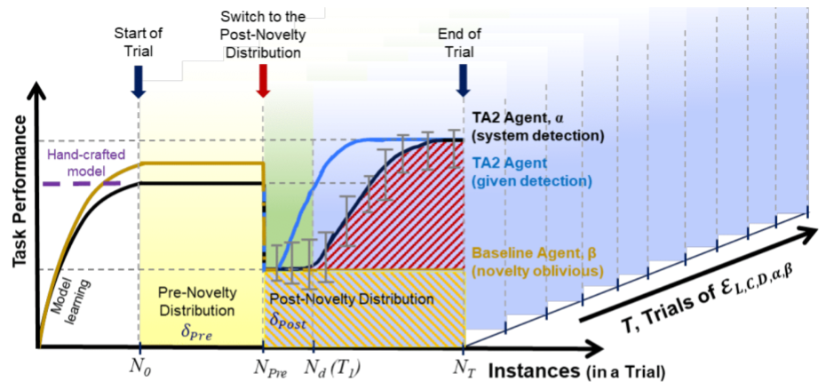
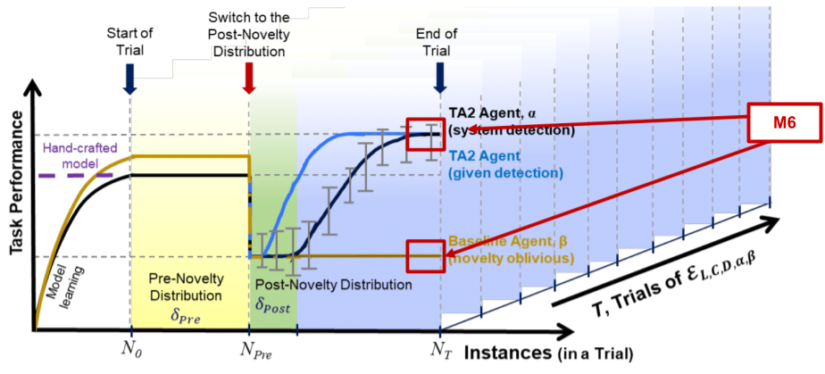

Program Metrics
===============

Introduction
------------
The sail on metrics evaluates the agents using two criteria

1. Detecting the instance when novelty was introduced.
2. Reacting and recovering from novelty.

The figure below shows the different points where the metrics
are calculated.

Symbols and Terms
-----------------

1. L: Novelty Level (L :math:`\in` [1,3])
#. C: Condition (C :math:`\in` [System Detection, Given Detection])
#. D: Domain (D} :math:`\in` [Visual Classification, Document Transcription, Activity Recognition])
#. :math:`\delta_{pre}`: A distribution of (pre novelty) instances from D at L = 0
#. :math:`\delta_{post}`: A distribution of (post novelty) instances from D at L :math:`\geq` 0
#. :math:`T_{pre}`: A sequence of instances drawn from :math:`\delta_{pre}`
#. :math:`T_{post}`: A sequence of instances drawn from :math:`\delta_{post}`
#. :math:`T`: A sequence of instances with :math:`T_{pre}` and :math:`T_{post}`
#. :math:`\alpha`: A TA2 agent
#. :math:`\beta`: A Baseline agent
#. :math:`\mathcal{E}_{L,C,D,\alpha,\beta}`: A set of :math:`\langle` L,C, D :math:`\rangle` on :math:`\alpha` and :math:`\beta`

M1: Average Number of FNs among Correctly Detected Trials
---------------------------------------------------------

Formal Definition
^^^^^^^^^^^^^^^^^

Let :math:`\delta(\alpha, x)` be the agent's distribution on instance x

.. math::
    CDT(\alpha, T) =  \begin{cases}
                        True & \delta_{post}(\alpha, x) \in T_{post} \\
                        False & \text{otherwise}
                      \end{cases}

.. math::
    \#CDT(\alpha, \mathcal{E}_\alpha) = \sum\limits_{T \in \mathcal{E}_\alpha} CDT(\alpha, T) = \text{True}

.. math::
    FN(\alpha, T) = \sum\limits_{x \in T_{post}} \delta (\alpha, x) = \delta_{pre}

.. math::
    \widetilde{FN}_{CDT}(\mathcal{E}_\alpha) =
    \begin{cases}
    \frac{1}{\#CDT(\alpha, \mathcal{E}_\alpha)} * \sum\limits_{T \in \mathcal{E}_\alpha \land CDT(\alpha, T)} FN(\alpha, T) & \#CDT(\alpha, \mathcal{E}_\alpha)  > 0 \\
    \text{N/A} & \text{Otherwise}
    \end{cases}

Pictorial Representation
^^^^^^^^^^^^^^^^^^^^^^^^

M2: Percentage of Correctly Detected Trials
-------------------------------------------

Formal Definition
^^^^^^^^^^^^^^^^^

.. math::
    CDT_{\%}(\mathcal{E}_\alpha) = \frac{1}{|\mathcal{E}_\alpha|}  \sum\limits_{T\in\mathcal{E}_\alpha}(CDT(\alpha, T) = \text{True})

Pictorial Representation
^^^^^^^^^^^^^^^^^^^^^^^^

M2.1: Percentage of False Positive Trials
-----------------------------------------

Formal Definition
^^^^^^^^^^^^^^^^^

.. math::
    FP(\alpha, T) = \sum\limits_{x \in T_{pre}}(\delta(\alpha, x) = \delta_{post})

    FP_{\%}(\mathcal{E}_\alpha) = \frac{1}{|\mathcal{E}_\alpha|}\sum\limits_{T\in\mathcal{E}_\alpha}(FP(\alpha, T)>0)

Pictorial Representation
^^^^^^^^^^^^^^^^^^^^^^^^

M3 and M4: Novelty Reaction Performance
---------------------------------------

Formal Definition
^^^^^^^^^^^^^^^^^

Let :math:`P_{pre, \beta}` be baselines average task performance on :math:`T_{pre}`
and :math:`P_{post,\alpha}` be the agents asymptotic task performance on :math:`T_{post}`

.. math::
    NRP(T) = \frac{P_{post, \alpha}}{P_{pre, \beta}}

    NRP(\mathcal{E}) = \frac{1}{N_\mathcal{E}} \sum\limits_{i=1}^{N_\mathcal{E}} NRP(T_i)

Pictorial Representation
^^^^^^^^^^^^^^^^^^^^^^^^

M5: Overall Performance Task Improvement
----------------------------------------

Formal Definition
^^^^^^^^^^^^^^^^^

Let :math:`P_{post, \beta}` be baselines average task performance on :math:`T_{post}`
and :math:`P_{post,\alpha}` be the agents task performance on :math:`T_{post}`

.. math::
    OPTI(T) = \frac{P_{post,\alpha}}{P_{post,\alpha} + P_{post, \beta}}

    OPTI = \frac{1}{N_{\mathcal{E}}}\sum\limits_{i=1}^{N_\mathcal{E}}OTPI(T_i)

Pictorial Representation
^^^^^^^^^^^^^^^^^^^^^^^^

M6: Asymptotic Performance Task Improvement
-------------------------------------------

Formal Definition
^^^^^^^^^^^^^^^^^

.. math::
    APTI(T) = \frac{\sum_{i=N_T-m}^{N_T}P_{post,\alpha}}{\sum_{i=N_T-m}^{N_T}P_{post,\beta}}

    APTI = \frac{1}{N_{\mathcal{E}}}\sum\limits_{i=1}^{N_\mathcal{E}}APTI(T_i)

where :math:`m` is asymptotic width that is domain dependent

Pictorial Representation
^^^^^^^^^^^^^^^^^^^^^^^^

