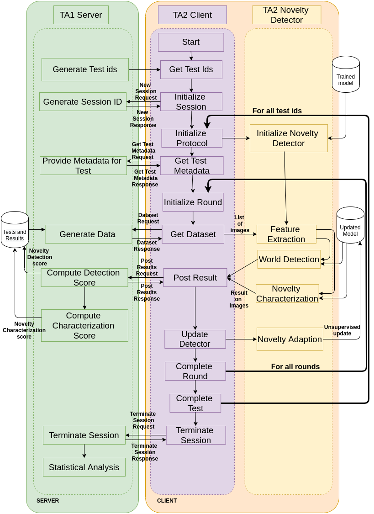
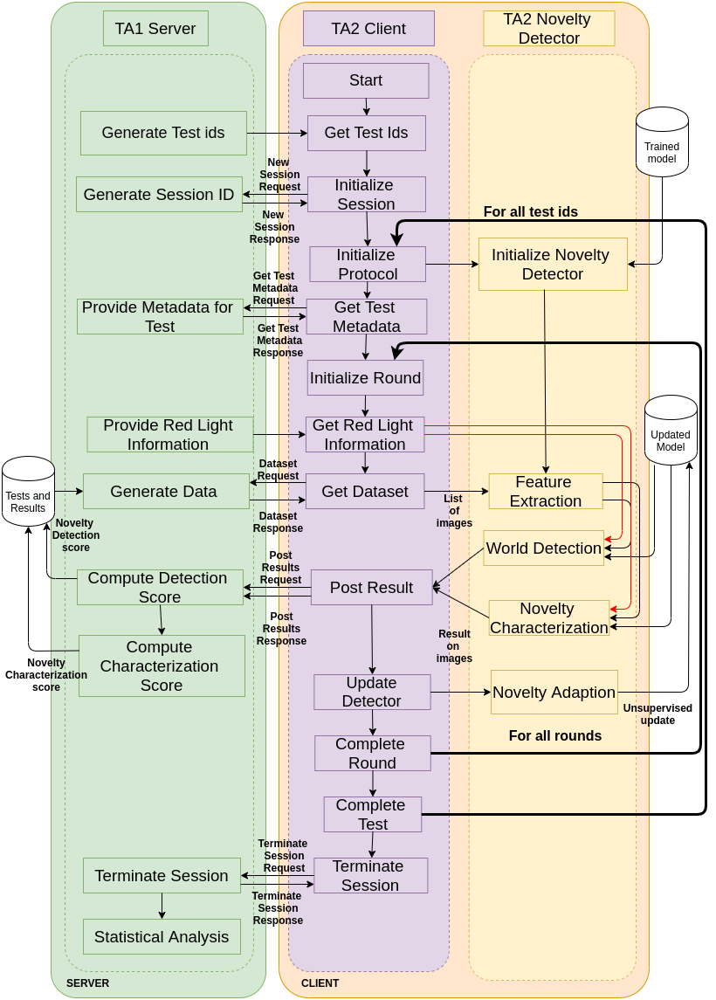

Continuous Open-set Novelty Detection, Discovery, Adaptation (CONDDA)
=====================================================================

**K+D+1 classification where K represents known classes, D are dicovered classes, 1 are all unknown classes**

Introduction
------------

This combines classification with novelty/object discovery (and is more natural
for Class Novelty). A TA2 agent starts with a K+1-way classification model (K known,
1 unknown) as in OND. During testing, the TA2 agent will discover clusters of
novelty (e.g., discover new classes) and accordingly add those as separate
classes in the prediction space (i.e., one of D discovered classes).

Image Classification Domain
---------------------------

Prediction Space
^^^^^^^^^^^^^^^^

1. Binary Classification Score: :math:`P_{world\_changed}`
2. K + D + 1 Characterization Score: :math:`P_{class} = [ p_{unknown}, p_1, ..., p_k, p_{cluster0}, ..., p_{clusterU}]`

WorkFlow For CONDDA
^^^^^^^^^^^^^^^^^^^

This section provides detailed workflow of the system in the evaluation condition

CONDDA Workflow With Red Light
""""""""""""""""""""""""""""""

CONDDA Workflow With Red Light
""""""""""""""""""""""""""""""

