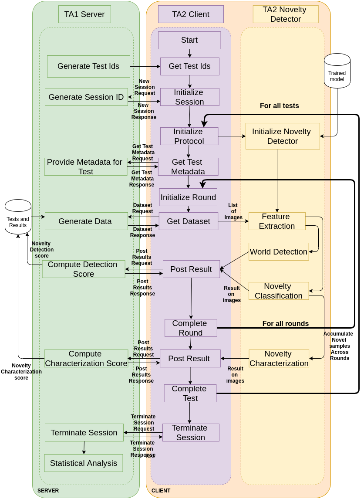
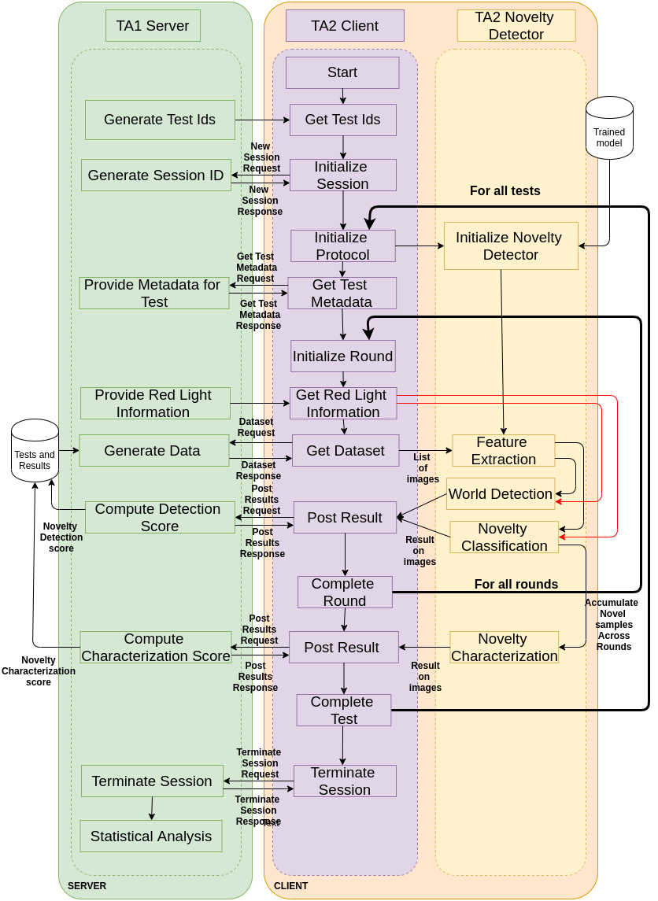

Open World Novelty Detection (OND)
==================================

**K+1 classification where K represents known classes, all unknown classes are grouped together**

Introduction
------------

This is the standard classification setup with an unknown class to flag/reject
samples that are deemed novel. A TA2 agent can adapt its internal representation
in any way during testing to model novel samples, but the expected prediction
space (K+1-classes) remains the same throughout a run.

Prediction Space
----------------

1. Binary Classification Score: :math:`P_{world\_changed}`
2. K + 1 Classification Score: :math:`P_{class} = [ p_{unknown}, p_1, ..., p_k]`

WorkFlow For OND
----------------

This section provides detailed workflow of the system in the evaluation condition.
OND protocol evaluates the open set capabilities of an agent along with its ability
to detect when novelty was introduced.

.. note:: The point where novelty is introduced is canonically referred to as the
   point when the red-button was pushed or when the agent saw the red-light.

OND workflow is executed under 2 different experimental setting

1. Without Red Light (System Detection)
2. With Red Light (Given Detection)

OND Workflow Without Red Light (System Detection)
^^^^^^^^^^^^^^^^^^^^^^^^^^^^^^^^^^^^^^^^^^^^^^^^^

The workflow of OND without red light is as follow.

#. Create a session on the server by providing a list of tests and hints
#. For a test with a fixed number of images/videos,
      #. Provide a mini-batch of image/video ids to the agent.
      #. The agent would use the mini-batch to determine if the novelty was introduced
         in the batch and provide K+1 classification score for every sample in the mini-batch
      #. Post the results the mini-batch to the server.
      #. Optional: Compute top1 and top3 score over the mini-batch of data.
#. Optional: Compute program metrics for the test.
#. Declare that the test is complete.
#. Terminate the session after all tests are complete.

OND Workflow With Red Light (Given Detection)
^^^^^^^^^^^^^^^^^^^^^^^^^^^^^^^^^^^^^^^^^^^^^

The workflow of OND with red light is as follow.

.. hint:: In given detection the agent is explicitly provided the image/video id
          where novelty was introduced in the test.

#. Create a session on the server by providing a list of tests and hints
#. For a test with a fixed number of images/videos,
      #. Provide the image/video id where novelty is introduced.
      #. Provide a mini-batch of image/video ids to the agent.
      #. The agent would use the mini-batch to determine and provide K+1
         classification score for every sample.
      #. Post the results the mini-batch to the server.
      #. Optional: Compute top1 and top3 score over the mini-batch of data.
#. Optional: Compute program metrics for the test.
#. Declare that the test is complete.
#. Terminate the session after all tests are complete.

